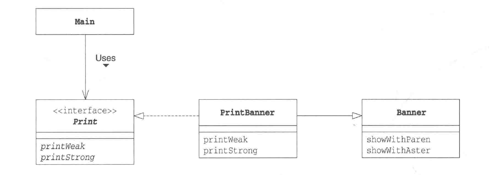
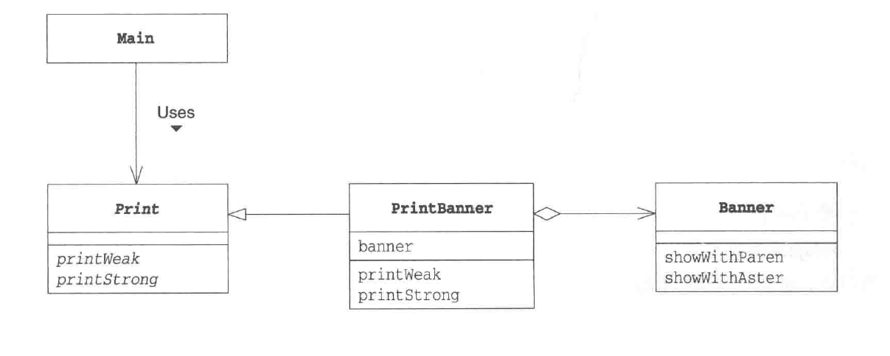

### Kylin Source

#### 三个设计模式
1. 工厂模式
生成数据源，生成计算引擎，生成数据存储。  
--，EngineFactory, StorageFactory

2. 适配器模式
两种实现：
(1): 通过继承的方式实现适配器模式。(也是 Kylin 采用的方法)
PrintBanner 实现 Print 接口，继承 Banner 类。

(2): 通过委托的方式实现适配器模式
PrintBanner 继承 Print 抽象类，组合 Banner 类。


3. Builder 模式  
  HiveTableMetaBuilder -> 生成 HiveTableMeta 对象

#### ISource
ISource 的两个主要实现类:  HiveSource, KafkaSource

```JAVA
package org.apache.kylin.source;

import java.io.Closeable;
import java.io.IOException;

import org.apache.kylin.metadata.model.IBuildable;
import org.apache.kylin.metadata.model.TableDesc;

/**
 * Represents a kind of source to Kylin, like Hive.
 */
public interface ISource extends Closeable {

    /** 
     * 返回一个数据源的元数据客户端.
     */
    ISourceMetadataExplorer getSourceMetadataExplorer();

    /**
     * 返回数据源，同时这个数据源适配了指定的构建引擎
     */
    <I> I adaptToBuildEngine(Class<I> engineInterface);

    /**
     * 返回一想可读的表，可以通过 rows 来迭代.
     */
    IReadableTable createReadableTable(TableDesc tableDesc, String uuid);

    /**
     * Give the source a chance to enrich a SourcePartition before build start.
     * Particularly, Kafka source use this chance to define start/end offsets within each partition.
     * 主要是指定表的分区相关信息。
     */
    SourcePartition enrichSourcePartitionBeforeBuild(IBuildable buildable, SourcePartition srcPartition);

    /**
     * Return an object that is responsible for deploying sample (CSV) data to the source database.
     * For testing purpose.
     * 用于测试的，可以先不用理它。
     */
    ISampleDataDeployer getSampleDataDeployer();

    /**
     * Unload table. 卸载表。
     */
    void unloadTable(String tableName, String project) throws IOException;
}
```

