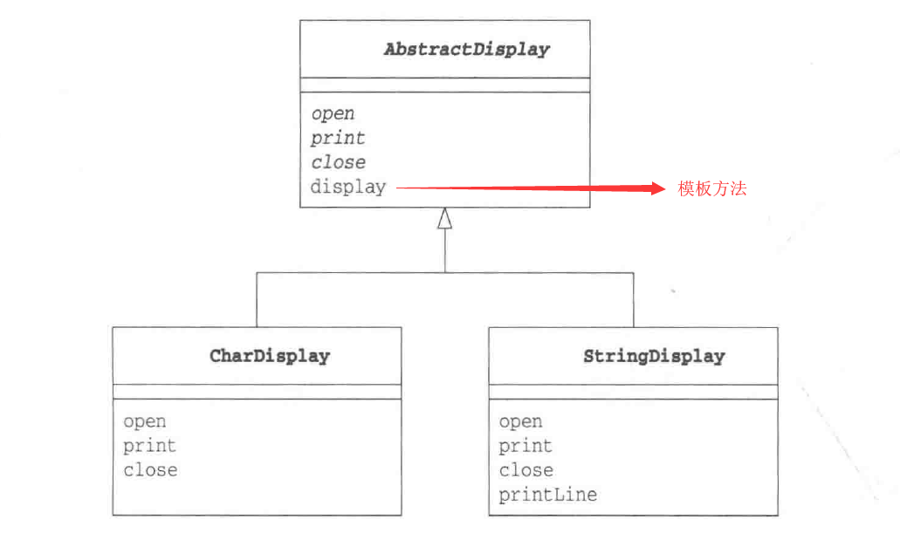
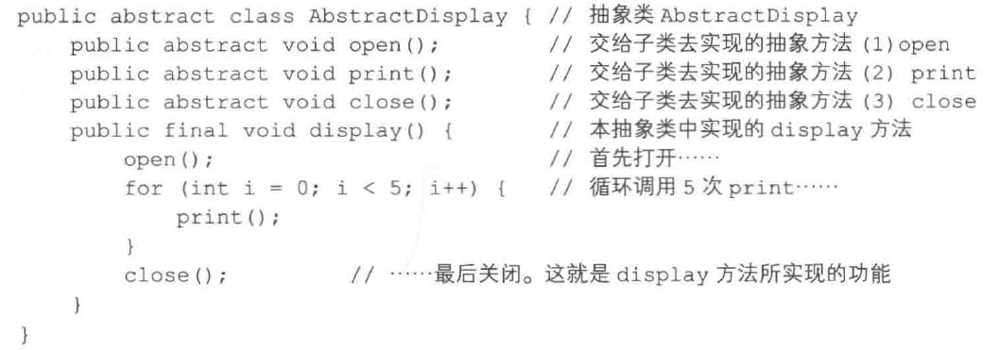
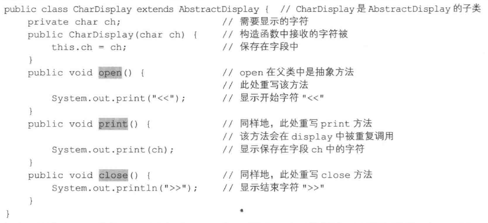

### 任务调度与执行
#### 参考资料
	1. zengrui: https://blog.csdn.net/zengrui_ops/article/details/85857320
	2. 编程小梦：https://blog.bcmeng.com/post/kylin-job.html
	3. 码迷：http://www.mamicode.com/info-detail-1015297.html
	4. http://itfish.net/article/47363.html 

#### 前置知识
##### JAVA 多线程编程
	关键知识点: 
	实现线程的三个抽象类，或接口： Thread, Runnable, Callable
	线程本地变量：ThreadLocal
	线程池：ExcutorService, ThreadPoolExecutor, ScheuleThreadPoolExecutor
	
##### 源代码
设计模式： 模板模式， 单例模式
* 模板模式
父类中定义处理流程的框架，子类中实现具体的处理的模式叫：Template Method
示例程序：将字符串循环显示一次打印

display方法： 1. 调用 open 2. 调用五次 print 3. 调用 close()
模板类：

具体类：

* 单例模式

