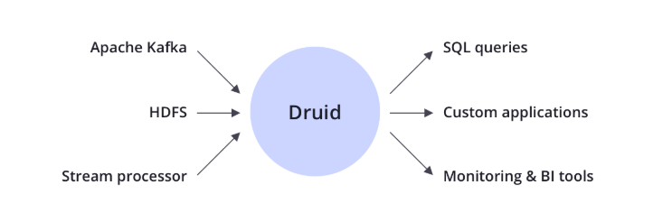
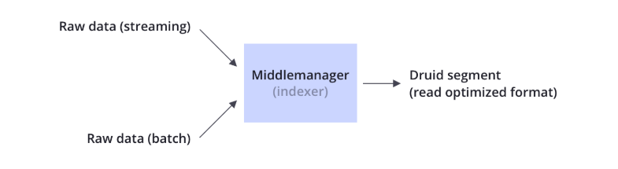
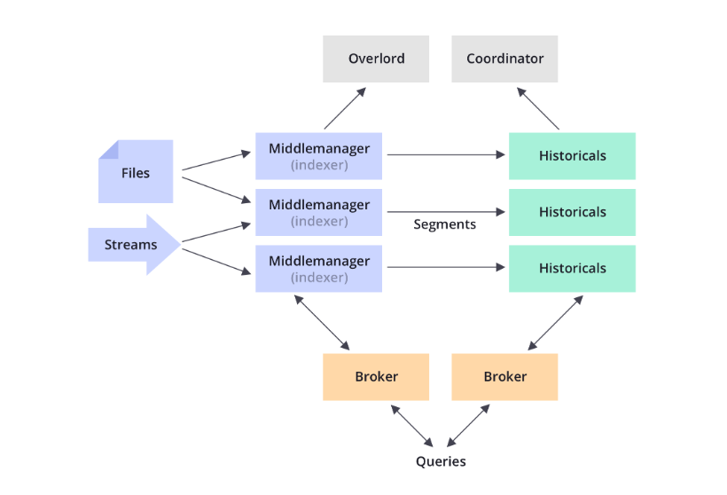

## Technology
    druid 和核心设计，组合了 olap 分析， 时间序列分析， 检索系统 等系统的 idea, 来形成一个统一系统。druid 包含了这三种系统的关键特点， 形成自身的摄入层，存储层，查询层，和核心层。
    使用案例：http://druid.apache.org/use-cases
### druid 的关键特点
#### 列式存储
    支持快速 scan, ranking, groupBy
#### 本地检索索引
#### 流式数据和批量数据摄取
#### 灵活 schema 
    nested data: http://druid.apache.org/docs/latest/ingestion/flatten-json
#### 面向时间的优化
#### 支持 sql
    druid 原生查询：http://druid.apache.org/docs/latest/querying/querying
    sql 支持：http://druid.apache.org/docs/latest/querying/sql
#### 水平扩展
#### 简单操作 

### Integration
 和 kylin 一样，上接 数据源，下开放接口给用户查询数据。 

### 数据摄入
    druid 会将原始数据转换成读优化的格式，叫做 druid segment, 这个过程叫做 indexing
    参考文档: http://druid.apache.org/docs/latest/ingestion/index.html

### 数据存储
    像很多的数据存储，druid 采用列式数据存储，依赖于各个列不同的数据类型，会采用不同的压缩格式以及编码方式。druid 会在不同的列上构建不同的类型索引。
    类似于其它的检索引擎，druid 会为 字符串类型的列构建倒排索引。类似于时间序列数据库，druid 会智能的对数据进行时间分区，这样可以回忆面向时间的查询。
    不像其它事务系统，druid 可以在数据摄取的进行数据预聚合。这种预聚合就是 rollup: http://druid.apache.org/docs/latest/tutorials/tutorial-rollup.html
   
### Quering
    druid 支持通过 json-over-http, sql(http://druid.apache.org/docs/latest/querying/sql) 查询数据, 
http://druid.apache.org/docs/latest/querying/querying.html

### architecture
    druid 可以理解成离散的数据库，druid 的核心进程（ingestion, quering, coordination）都可以分别部署或者联合部署。
    druid 显式的命名各个组件进程，可以让用户对对于各个组件，根据用户案例以及负载情况，进行分别的优化。比如说用户可以给 ingestion 这个组件更多的资源，而对于 query 引擎给较少的资源。
    druid 的各个组件可以在失败的时候对于其它组件没有任何影响。

    更多信息可以参考：http://druid.apache.org/docs/latest/design/index.html
### Operations 
#### 数据副本
#### 进程独立
#### 自动数据备份
#### 滚动更新

