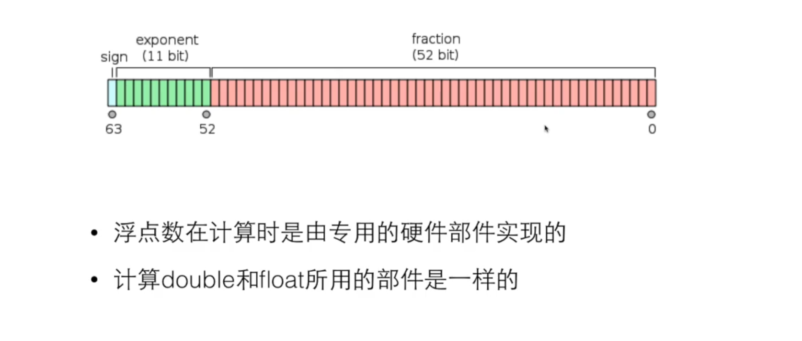

## 数据类型
    sizeof 查年数据类型所占用的空间大小: sezeof(int) //4
    // $ gcc test.c -o test -m32
### 整数类型
1. 寄存器是位数是机器的位数: 32 位, 64 位
2. cpu 里面有寄存器, 然后通过总线和 内存 ram 进行交互. 


3. 整数的内部表达   
    1) 计算机内部都是二进制  
    2) 负数的三种表示方法 // 以 1 字节为例   
       a. 仿照10进制, 有一个特殊的标志来标记负数  
       b. 取中间的数据, 如 10000000 表示为零, 小于他的数据是负数, 大于他的数是负数  
       c. 补码 // 补码的意义就是补码与原码可以加出来一个溢出的 1 
4. 数的范围
    1) 对于一个字节 8 位, 可以表达的是
       * 00000000 ~ 11111111  
    其中:  
       * 00000000 -> 0
       * 11111111 ~ 100000000 => -1 ~ -128
       * 00000000 ~ 011111111 => 0 ~ 127
    2) 对于负数 -a, 他的补码就是 0-a, 实际就是 2^n - a, n 是这个类型的位数.
    3) unsigned char c = 255 // 无符号整数
    4) 将数的范围想象成一个环:   
       有符号整数: 0 ~ 127 ~ -128 ~ -1 ~ 0
       无符号整数: 0 ~ 255 ~ 0
5. 整数的格式化,如何对整数进行输入输出  
    1) 两种形式, int, long long
    2) d% int
       u% unsigned
       ld% long long
       lu% unsigned long long
    3) int a = 012 // 八进制的数,相当于 10  
       int b = 0x12 // 16 进制的数, 相当于 18
       这种表示只是一个字面量的输入
       %o 用于八进制, %x 用于 16 进制
### 浮点类型
1. float and long
2. 1.0/0 = inf; -1.0/0 = -inf; 0.0/0=nan
   整数除以 0 是有问题的,编译就通不过. 但是浮点数对于数据是支持无穷大,无穷小的这个概念的.
3. 浮点的运算是没有精度的.
```C
float a, b, c
a = 1.345f
b = 1.123f
c = a + b
// c 与 2.468 是不相等的. c: 2.46799....
```
4. 小数后面加上 f, 就是 float ,不加f 就是 double 数据
5. f1==f2 可能是会失败的, 如果我们使用: fabs(f1-f2) < 1e-12, 我们就认为数据是相等的.
6. 浮点数的内部表达
计算机对于浮点数的支持是基于硬件的.


### 逻辑类型
1. C语言本没有逻辑类型，在内部计算中使用整数表达关系运算和逻辑运算的结果，0表示false，而非0的值表示true。
在C99中，也没有固有的逻辑类型，但是通过一个头文件定义了可以直接使用的true和false这两个值，以及bool这个类型。
逻辑运算则是C语言固有的成分。
2. 