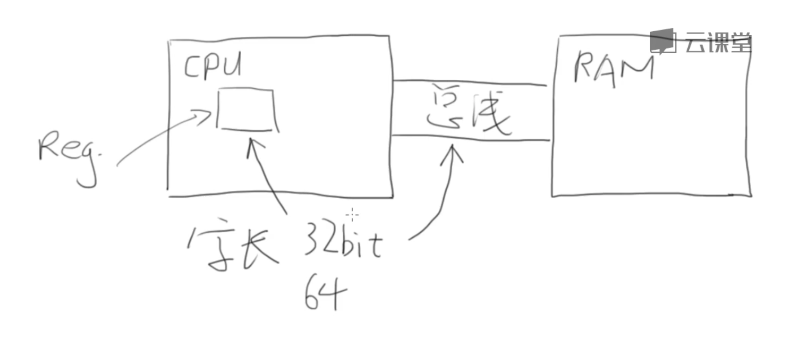

## 数据类型
    sizeof 查年数据类型所占用的空间大小: sezeof(int) //4
    // $ gcc test.c -o test -m32
### 整数类型
1. 寄存器是位数是机器的位数: 32 位, 64 位
2. cpu 里面有寄存器, 然后通过总线和 内存 ram 进行交互. 

3. 整数的内部表达   
    1) 计算机内部都是二进制  
    2) 负数的三种表示方法 // 以 1 字节为例   
       a. 仿照10进制, 有一个特殊的标志来标记负数  
       b. 取中间的数据, 如 10000000 表示为零, 小于他的数据是负数, 大于他的数是负数  
       c. 补码  
    3) 